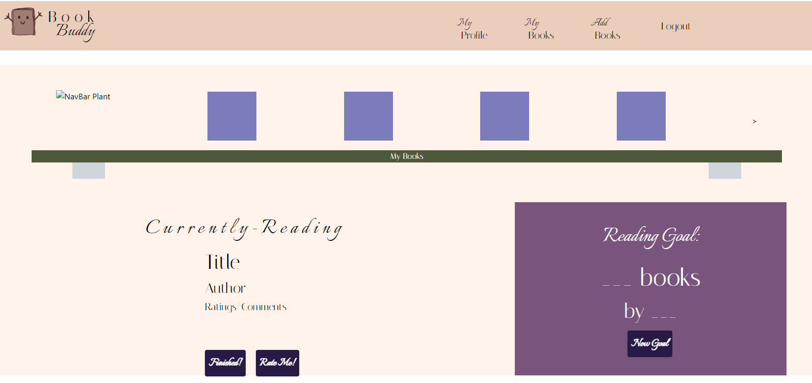

# Book-Buddy

## Table of Contents
* [Description](#description)
* [Install](#install)
* [Contribution](#contribution)
* [Usage](#usage)
* [Testing](#testing)
* [Questions](#questions)
* [License](#license)
* [Deployed](#deployed)
* [Image](#image)

## Description
A collaberation project that showcases knowledge of REACT, MERN, amd Apollo Servers to create a App that allows users to log in to our Website and search a Open API Library to add books they are interested into their Booklist, and update book reading goals 

## Install
NPM packages apollo-server-express, bcrypt, express, graphQL, jswebtoken, mongoose, @apollo/server

## Contribution
please review package-lock.json for contribution

## Usage
Public

## Testing
NaN

## Questions
Please reach out to us though our GitHub or via our E-mail with any questions or concerns you may have  
Nicole Cohen: nicolesoccer9@comcast.net / [github.com/nrose19](https://github.com/nrose19) 
Claire Bain: Claire.bain3@gmail.com / [github.com/Clairebain3](https://github.com/Clairebain3) 
Kim Van Wyk: Kmvanwyk@msn.com / [github.com/vanwykkim](https://github.com/vanwykkim) 
Ravi Nagi: rasvindra@hotmail.com / [github.com/rasvindra](https://github.com/rasvindra) 
Colin Marshall: colin.marshall94@gmail.com / [github.com/CascadeColin](https://github.com/CascadeColin) 

## License
MIT

## Deployed
<!-- deployed link -->

## Image
